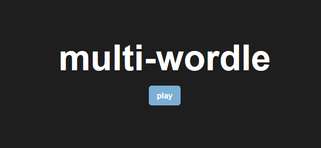
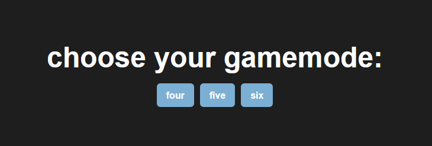

# Multi-Wordle

A rendition of [Wordle](https://www.nytimes.com/games/wordle/index.html) that has four, five, and six letter gamemodes. Built using Next, React, TypeScript, Prisma, PostgreSQL, Node.js, and Tailwind CSS. 

